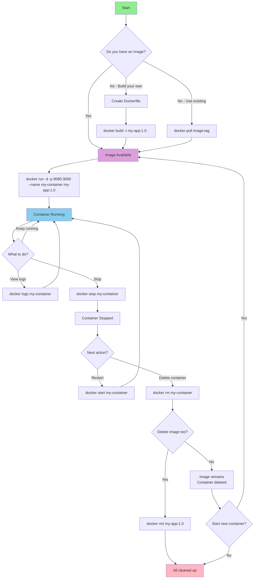

# Docker Documentation

## Table of Contents
1. [What is Docker?](#what-is-docker)
2. [Docker Workflow Diagram](#docker-workflow-diagram)
3. [Basic Docker Commands](#basic-docker-commands)
4. [Pulling an Image from Docker Hub](#pulling-an-image-from-docker-hub)
5. [What is a Dockerfile?](#what-is-a-dockerfile)
6. [Building an Image from Dockerfile](#building-an-image-from-dockerfile)
7. [Starting a Container](#starting-a-container)
8. [Binding Ports](#binding-ports)
9. [Stopping a Container](#stopping-a-container)
10. [Running a Container](#running-a-container)
11. [Stopping and Deleting a Container](#stopping-and-deleting-a-container)
12. [Deleting an Image](#deleting-an-image)
13. [Quick Reference Summary](#quick-reference-summary)
14. [Best Practices](#best-practices)
15. [Troubleshooting Tips](#troubleshooting-tips)
16. [Exam Practice Questions](#exam-practice-questions)

---

## What is Docker?

Docker is a platform that allows developers to package applications and their dependencies into lightweight, portable containers. These containers can run consistently across different computing environments, from development to production.

**Key Concepts:**
- **Container**: A lightweight, standalone package that includes everything needed to run an application (code, runtime, libraries, and dependencies)
- **Image**: A read-only template used to create containers. Think of it as a blueprint for containers
- **Dockerfile**: A text file containing instructions to build a Docker image
- **Docker Hub**: A cloud-based registry where Docker images are stored and shared

---

## Docker Workflow Diagram

Here's a visual representation of the basic Docker workflow:




**Workflow Explanation:**

1. **Get an Image**: Either pull from Docker Hub or build from a Dockerfile
2. **Run Container**: Create and start a container from the image
3. **Manage Container**: Monitor, stop, or restart as needed
4. **Cleanup**: Remove containers and images when no longer needed

---

## Basic Docker Commands

Here are the fundamental Docker commands you'll use regularly:

```bash
# Check Docker version
docker --version

# View Docker system information
docker info

# List all running containers
docker ps

# List all containers (including stopped ones)
docker ps -a

# List all images on your system
docker images

# Get help for any Docker command
docker [command] --help
```

---

## Pulling an Image from Docker Hub

Docker Hub is a cloud-based registry where Docker images are stored and shared. Instead of building your own image, you can pull pre-built images from Docker Hub.

**Why use docker pull?**
- Get official images (like nginx, node, python, mysql)
- Use community-created images
- Download specific versions of software
- Faster than building from scratch

**Step 1: Search for an image (optional)**
```bash
# Search for images on Docker Hub
docker search nginx
```

**Step 2: Pull an image**
```bash
docker pull image-name
```

**Basic Examples:**

**Pull the latest version:**
```bash
docker pull nginx
```
This pulls the `nginx:latest` image.

**Pull a specific version (tag):**
```bash
docker pull nginx:1.25
```

**Pull from a specific registry:**
```bash
docker pull node:18-alpine
```

**Command Breakdown:**
- `docker pull`: The command to download an image
- `nginx`: The image name
- `:1.25`: The tag (version) - if omitted, defaults to `:latest`

**Step 3: Verify the image was pulled**
```bash
docker images
```

You should see the pulled image in your local image list.

**Common Examples:**

```bash
# Pull Python image
docker pull python:3.11

# Pull MySQL database
docker pull mysql:8.0

# Pull Node.js image
docker pull node:18-alpine

# Pull Ubuntu operating system
docker pull ubuntu:22.04

# Pull Redis cache
docker pull redis:7-alpine
```

**Pull all tags of an image:**
```bash
docker pull --all-tags nginx
```
Warning: This downloads all available versions and can use significant disk space.

**Check image details before pulling:**
Visit Docker Hub at https://hub.docker.com to see:
- Available tags/versions
- Image documentation
- Size information
- Usage examples

**After pulling, you can run the image:**
```bash
# Pull the image
docker pull nginx:latest

# Run a container from the pulled image
docker run -d -p 8080:80 nginx:latest
```

---

## What is a Dockerfile?

A Dockerfile is a text document that contains all the commands needed to build a Docker image. It's essentially a recipe that tells Docker how to create your application's environment.

**Basic Dockerfile Structure:**

```dockerfile
# Start from a base image
FROM node:18-alpine

# Set the working directory in the container
WORKDIR /app

# Copy package files
COPY package*.json ./

# Install dependencies
RUN npm install

# Copy application files
COPY . .

# Expose the port the app runs on
EXPOSE 3000

# Command to run when container starts
CMD ["npm", "start"]
```

**Common Dockerfile Instructions:**
- `FROM`: Specifies the base image to use
- `WORKDIR`: Sets the working directory inside the container
- `COPY`: Copies files from your local machine to the container
- `RUN`: Executes commands during the image build process
- `EXPOSE`: Documents which port the container will listen on
- `CMD`: Specifies the default command to run when the container starts

---

## Building an Image from Dockerfile

To build a Docker image from a Dockerfile, use the `docker build` command.

**Step 1: Navigate to the directory containing your Dockerfile**
```bash
cd /path/to/your/project
```

**Step 2: Build the image**
```bash
docker build -t my-app:1.0 .
```

**Command Breakdown:**
- `docker build`: The command to build an image
- `-t my-app:1.0`: Tags the image with a name (`my-app`) and version (`1.0`)
- `.`: Specifies the build context (current directory)

**Example:**
```bash
# Build an image named "web-app" with tag "latest"
docker build -t web-app:latest .

# Build without using cache
docker build --no-cache -t web-app:latest .
```

**Step 3: Verify the image was created**
```bash
docker images
```

You should see your newly created image in the list.

---

## Starting a Container

To start a container from an image, use the `docker start` command. However, this is typically used for containers that were previously created and stopped.

**Step 1: Create and start a container**
```bash
docker create --name my-container my-app:1.0
docker start my-container
```

**Command Breakdown:**
- `docker create`: Creates a container from an image but doesn't start it
- `--name my-container`: Assigns a name to the container
- `my-app:1.0`: The image to use
- `docker start my-container`: Starts the container

**Alternative - Start an existing stopped container:**
```bash
docker start my-container
```

**Start container and view logs:**
```bash
docker start -a my-container
```
The `-a` flag attaches to the container's output.

---

## Binding Ports

Port binding allows you to map a port on your host machine to a port in the container, making your application accessible.

**Syntax:**
```bash
docker run -p [HOST_PORT]:[CONTAINER_PORT] image-name
```

**Step 1: Run a container with port binding**
```bash
docker run -p 8080:3000 my-app:1.0
```

**Command Breakdown:**
- `-p 8080:3000`: Maps port 8080 on your host to port 3000 in the container
- Your application running on port 3000 inside the container will be accessible at `http://localhost:8080` on your host machine

**Multiple Port Bindings:**
```bash
docker run -p 8080:3000 -p 9090:9000 my-app:1.0
```

**Bind to all interfaces:**
```bash
docker run -p 0.0.0.0:8080:3000 my-app:1.0
```

**Bind to localhost only:**
```bash
docker run -p 127.0.0.1:8080:3000 my-app:1.0
```

---

## Stopping a Container

To stop a running container, use the `docker stop` command.

**Step 1: Find the container ID or name**
```bash
docker ps
```

**Step 2: Stop the container**
```bash
docker stop my-container
```

Or using the container ID:
```bash
docker stop abc123def456
```

**Stop multiple containers:**
```bash
docker stop container1 container2 container3
```

**Force stop (kill) a container:**
If a container doesn't stop gracefully, you can force it:
```bash
docker kill my-container
```

**Stop all running containers:**
```bash
docker stop $(docker ps -q)
```

---

## Running a Container

The `docker run` command creates and starts a container in one step. This is the most common way to start containers.

**Basic Syntax:**
```bash
docker run [OPTIONS] IMAGE [COMMAND]
```

**Step 1: Run a simple container**
```bash
docker run my-app:1.0
```

**Step 2: Run with common options**

**Run in detached mode (background):**
```bash
docker run -d my-app:1.0
```

**Run with a custom name:**
```bash
docker run --name my-running-app my-app:1.0
```

**Run with port binding:**
```bash
docker run -p 8080:3000 my-app:1.0
```

**Run in interactive mode:**
```bash
docker run -it my-app:1.0 /bin/bash
```

**Complete example with multiple options:**
```bash
docker run -d \
  --name my-web-app \
  -p 8080:3000 \
  -v /host/path:/container/path \
  my-app:1.0
```

**Command Breakdown:**
- `-d`: Detached mode (runs in background)
- `--name my-web-app`: Names the container
- `-p 8080:3000`: Maps ports
- `-v /host/path:/container/path`: Mounts a volume
- `my-app:1.0`: The image to use

**Run and automatically remove container when it exits:**
```bash
docker run --rm my-app:1.0
```

---

## Stopping and Deleting a Container

To completely remove a container, you must first stop it, then delete it.

**Step 1: Stop the container**
```bash
docker stop my-container
```

**Step 2: Delete (remove) the container**
```bash
docker rm my-container
```

**Shortcut - Force remove a running container:**
```bash
docker rm -f my-container
```
The `-f` flag forces removal even if the container is running.

**Complete process example:**
```bash
# List all containers
docker ps -a

# Stop the container
docker stop my-web-app

# Remove the container
docker rm my-web-app

# Verify removal
docker ps -a
```

**Remove multiple containers:**
```bash
docker rm container1 container2 container3
```

**Remove all stopped containers:**
```bash
docker container prune
```

You'll be prompted to confirm. Use `-f` to skip confirmation:
```bash
docker container prune -f
```

---

## Deleting an Image

To delete a Docker image, use the `docker rmi` (remove image) command.

**Step 1: List all images**
```bash
docker images
```

**Step 2: Delete an image by name and tag**
```bash
docker rmi my-app:1.0
```

**Delete an image by Image ID:**
```bash
docker rmi abc123def456
```

**Force delete an image:**
If containers are using the image, you'll need to force delete:
```bash
docker rmi -f my-app:1.0
```

**Important Note:** You cannot delete an image if any containers (even stopped ones) are using it. You must remove those containers first.

**Complete workflow:**
```bash
# 1. List images
docker images

# 2. Find containers using the image
docker ps -a --filter ancestor=my-app:1.0

# 3. Remove any containers
docker rm $(docker ps -a --filter ancestor=my-app:1.0 -q)

# 4. Delete the image
docker rmi my-app:1.0

# 5. Verify removal
docker images
```

**Delete multiple images:**
```bash
docker rmi image1:tag1 image2:tag2 image3:tag3
```

**Remove all unused images:**
```bash
docker image prune
```

**Remove all images (use with caution):**
```bash
docker rmi $(docker images -q)
```

**Remove dangling images (images with no tags):**
```bash
docker image prune -f
```

---

## Quick Reference Summary

```bash
# Pull an image from Docker Hub
docker pull nginx:latest

# Build an image
docker build -t my-app:1.0 .

# Run a container
docker run -d -p 8080:3000 --name my-container my-app:1.0

# List running containers
docker ps

# Stop a container
docker stop my-container

# Start a stopped container
docker start my-container

# Stop and remove a container
docker stop my-container && docker rm my-container

# Force remove a running container
docker rm -f my-container

# Delete an image
docker rmi my-app:1.0

# List all images
docker images

# List all containers
docker ps -a
```

---

## Best Practices

1. **Always tag your images** with meaningful names and versions
2. **Use .dockerignore** file to exclude unnecessary files from the build context
3. **Clean up regularly** - remove unused containers and images to free up disk space
4. **Use specific base image versions** instead of `latest` for reproducibility
5. **Run containers in detached mode** (`-d`) for long-running services
6. **Name your containers** for easier management
7. **Use port binding** appropriately to avoid conflicts

---

## Troubleshooting Tips

**Container won't start:**
```bash
# Check container logs
docker logs my-container

# Check last 50 lines of logs
docker logs --tail 50 my-container

# Follow logs in real-time
docker logs -f my-container
```

**Port already in use:**
- Change the host port: `docker run -p 8081:3000 my-app:1.0`
- Or stop the service using that port

**Image build fails:**
- Check your Dockerfile syntax
- Ensure all files being copied exist
- Review build logs for specific errors

**Can't delete image:**
- First remove all containers using that image
- Use `docker ps -a` to find stopped containers

---

## Exam Practice Questions

### Question 1: Building and Running a Web Application

**Scenario:** You have a Node.js application in a directory with a Dockerfile. You need to build an image called "web-app" with version "2.0", then run it as a container named "production-app" that maps port 3000 inside the container to port 8080 on your host machine, running in detached mode.

**Question:** Write the complete sequence of Docker commands to accomplish this task.

**Solution:**
```bash
# Step 1: Build the image
docker build -t web-app:2.0 .

# Step 2: Run the container
docker run -d -p 8080:3000 --name production-app web-app:2.0

# Step 3: Verify the container is running
docker ps
```

**Explanation:**
- `docker build -t web-app:2.0 .` creates an image named "web-app" with tag "2.0" from the Dockerfile in the current directory
- `docker run -d` runs the container in detached mode (background)
- `-p 8080:3000` maps host port 8080 to container port 3000
- `--name production-app` assigns the name "production-app" to the container
- `web-app:2.0` specifies which image to use
- `docker ps` confirms the container is running

---

### Question 2: Pulling and Running an Official Image

**Scenario:** Your team needs to set up a MySQL database for testing. You need to pull MySQL version 8.0 from Docker Hub and run it with the container name "test-database", mapping the default MySQL port (3306) to the same port on your host.

**Question:** What commands would you use, and in what order?

**Solution:**
```bash
# Step 1: Pull the MySQL image
docker pull mysql:8.0

# Step 2: Verify the image was downloaded
docker images

# Step 3: Run the MySQL container
docker run -d -p 3306:3306 --name test-database mysql:8.0

# Step 4: Check if the container is running
docker ps
```

**Explanation:**
- `docker pull mysql:8.0` downloads the MySQL 8.0 image from Docker Hub
- `docker images` lists all local images to confirm the download
- `docker run -d -p 3306:3306 --name test-database mysql:8.0` creates and starts the container
- The MySQL container runs on port 3306 by default, so we map it to the same port on the host

---

### Question 3: Container Lifecycle Management

**Scenario:** You have a running container named "api-server" that needs to be restarted. After restarting, you discover it has issues and needs to be completely removed along with its image "api-app:1.5".

**Question:** Write the complete sequence of commands to stop, restart, then ultimately stop and remove both the container and image.

**Solution:**
```bash
# Step 1: Stop the container
docker stop api-server

# Step 2: Start it again (restart)
docker start api-server

# Step 3: After discovering issues, stop it again
docker stop api-server

# Step 4: Remove the container
docker rm api-server

# Step 5: Remove the image
docker rmi api-app:1.5

# Alternative: Force remove running container in one command
# docker rm -f api-server

# Alternative: Stop and remove in one line
# docker stop api-server && docker rm api-server
```

**Explanation:**
- `docker stop api-server` gracefully stops the running container
- `docker start api-server` restarts the stopped container
- `docker rm api-server` removes the container (must be stopped first)
- `docker rmi api-app:1.5` deletes the image (no containers can be using it)
- The alternatives show more efficient ways to accomplish the same tasks

---

### Question 4: Multiple Port Bindings

**Scenario:** You're deploying a web application that serves content on port 3000 and has an admin panel on port 9000. You need to run this application in a container named "multi-port-app" from an image called "webapp:latest", making the web content available on host port 80 and the admin panel on host port 9090.

**Question:** Write the docker run command with the correct port mappings.

**Solution:**
```bash
docker run -d \
  --name multi-port-app \
  -p 80:3000 \
  -p 9090:9000 \
  webapp:latest
```

**Explanation:**
- `-p 80:3000` maps the web content (container port 3000) to host port 80
- `-p 9090:9000` maps the admin panel (container port 9000) to host port 9090
- Multiple `-p` flags can be used for multiple port bindings
- After running this command:
  - Web content accessible at: `http://localhost:80`
  - Admin panel accessible at: `http://localhost:9090`

---

### Question 5: Dockerfile to Running Container

**Scenario:** You're given this Dockerfile for a Python application:

```dockerfile
FROM python:3.11-slim
WORKDIR /app
COPY requirements.txt .
RUN pip install -r requirements.txt
COPY . .
EXPOSE 5000
CMD ["python", "app.py"]
```

**Question:** 
a) Build an image named "python-app" with tag "v1.0" from this Dockerfile  
b) Run a container named "flask-api" that maps port 5000 to port 8000 on the host  
c) View the running container's logs  
d) Stop and remove the container  
e) Delete the image  

**Solution:**
```bash
# a) Build the image
docker build -t python-app:v1.0 .

# b) Run the container with port mapping
docker run -d -p 8000:5000 --name flask-api python-app:v1.0

# c) View the logs
docker logs flask-api
# Or follow logs in real-time:
# docker logs -f flask-api

# d) Stop and remove the container
docker stop flask-api
docker rm flask-api
# Or in one command:
# docker rm -f flask-api

# e) Delete the image
docker rmi python-app:v1.0
```

**Explanation:**
- The Dockerfile uses Python 3.11, sets working directory to /app, installs dependencies, copies application files, exposes port 5000, and runs the app
- `docker build -t python-app:v1.0 .` creates the image from the Dockerfile
- The application runs on port 5000 inside the container (as specified by EXPOSE)
- `-p 8000:5000` makes it accessible on port 8000 on your host machine
- `docker logs flask-api` shows all output from the container
- The container must be stopped before removal (unless using `-f` flag)
- The image can only be deleted after all containers using it are removed

---

## Answer Key Summary

1. **Building and Running**: `docker build` → `docker run` with `-d`, `-p`, and `--name`
2. **Pulling Images**: `docker pull` → `docker run` with appropriate ports
3. **Lifecycle Management**: `docker stop` → `docker start` → `docker rm` → `docker rmi`
4. **Multiple Ports**: Multiple `-p` flags in `docker run`
5. **Complete Workflow**: Build → Run → Manage → Remove (full lifecycle)

---
